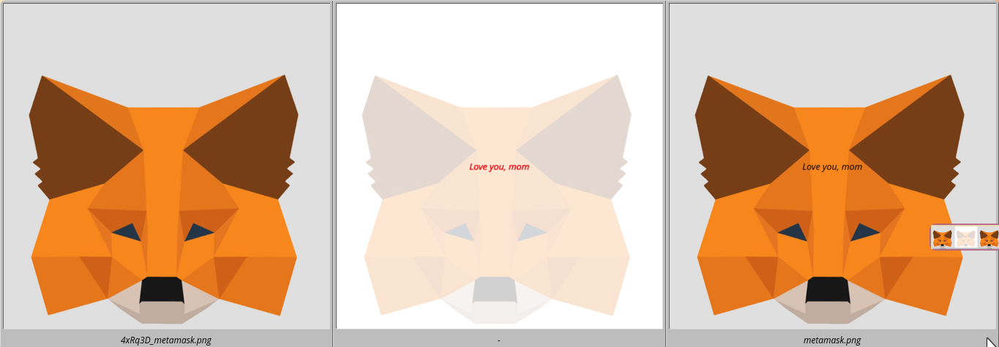

<h1 align="center">diffimage</h1>

<h3 align="center"><em>A visual diffs for the images in the git repository.</em></h3>


## Demo



## Dependencies

Debian/Ubuntu:
```bash
$ sudo apt-get install imagemagick
```

Arch:
```bash
$ sudo pacman -S imagemagick
```

## Installation
```bash
make install
```


## Usage
```bash
git diff
```


## License
Licensed under the [GPL-v3 License](LICENSE).
